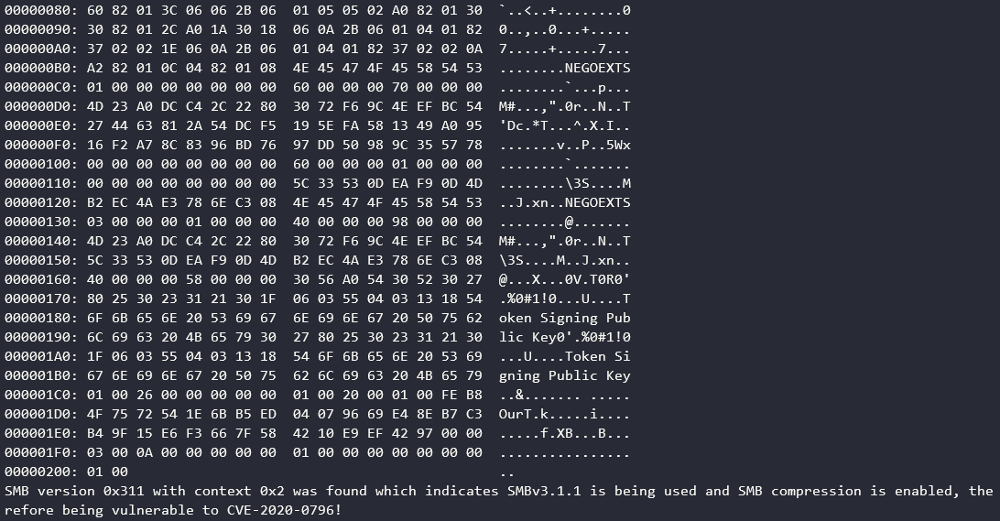

# SMBGhost
This repository contains my scanner script which lets you know whether your server uses SMBv3.1.1 and has SMB compression enabled. Ultimately, this means you are vulnerable to [CVE-2020-0796](https://portal.msrc.microsoft.com/en-US/security-guidance/advisory/CVE-2020-0796). At this point of time a security patch was released, please make sure to update!

## Usage
The module has extensive logging and requires the library `hexdump` which you can install with `pip3 install --user hexdump`. If you don't want logging you can use the script in `logless_scanner.py`.

```
python3 .\scanner.py 127.0.0.1 445
NetBIOS (4): 000000c0
Header (64): fe534d42400000000000000000001f00000000000000000000000000000000000000000000000000000000000000000000000000000000000000000000000000
Negotiation (128): 24000800010000007f000000000000000000000000000000000000007800000002000000020210022202240200030203100311030000000001002600000000000100200001000100000000000000000000000000000000000000000000000000000000000000000003000a000000000001000000010000000100000000000000
Packet (196): 000000c0fe534d42400000000000000000001f0000000000000000000000000000000000000000000000000000000000000000000000000000000000000000000000000024000800010000007f000000000000000000000000000000000000007800000002000000020210022202240200030203100311030000000001002600000000000100200001000100000000000000000000000000000000000000000000000000000000000000000003000a000000000001000000010000000100000000000000
```

Some output was ommited for the sake of a cleaner README. If you are vulnerable, the script will output the following text:

```
SMB version 0x311 with context 0x2 was found which indicates SMBv3.1.1 is being used and SMB compression is enabled, therefore being vulnerable to CVE-2020-0796!
```



## Workarounds
If you are unable to install the security patch provided by Microsoft please consider disabling SMB compression using the following command:

```powershell
Set-ItemProperty -Path "HKLM:\SYSTEM\CurrentControlSet\Services\LanmanServer\Parameters" DisableCompression -Type DWORD -Value 1 -Force
```

However, this will not protect you from getting exploited if you are the client connecting to an exploited machine.
